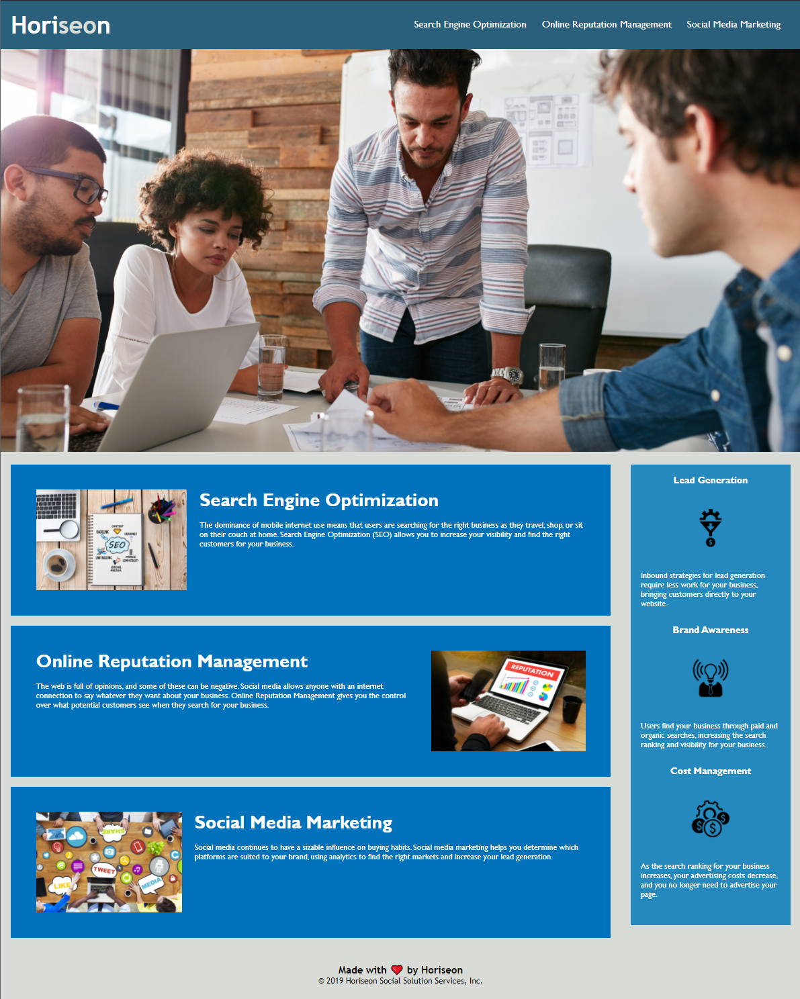

# Homework_01_Refactoring_and_Accessability
Homework Assignment 01 - Due EOD 9/10/21

Client requested that we comb their site and execute changes to improve the accessability for their users and future developers. To that end:
* Semantic tags were inserted where appropriate to improve usability and clarity for future developers. Inserted in place of a generic Div are the following.
  * Main
  * Header
  * Nav
  * Section
  * Footer
* CSS code has been married to the new semantic nomenclature in use. 
* All images have had an alt tag added.
* The SEO link was broken and is now fixed.
* General cleaning and tidying. 

Website appearance has not been altered:

[Click here or the image above to vist the site.](./index.html/)